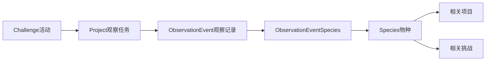

# 鸟类观察试点落地方案

## 一、文档目标

这份方案把“鸟类观察”从抽象方向落成一套可直接进入当前平台的第一期内容方案，目标是先跑通：

- 一个鸟类主题挑战
- 三个可挂在挑战下的项目
- 一组可直接转成项目文案和后续物种种子数据的内容素材
- 第二阶段需要补的 `Observation Event` 与 `Species` 数据模型

当前建议采用“先复用、后扩模”的路径：

- 第一阶段先复用现有 `Challenge + Project`
- 第二阶段再补 `Observation Event + Species`

## 二、第一期试点主题

### 1. 推荐主题

`北京春季常见鸟类观察`

### 2. 为什么先做这个主题

- 北京本地性强，容易和《北京自然观察手册：鸟类》的内容对齐
- 春季鸟类活跃，既能看见常见留鸟，也能看到部分迁徙相关现象
- 既可以做“公园水鸟观察”，也可以做“校园与社区常见鸟类观察”
- 相比一上来做完整鸟类库，更容易快速产出可上线内容

### 3. 第一阶段边界

第一阶段只解决“活动能跑起来、项目能发布、用户能参与”的问题，不解决以下能力：

- 独立物种页
- 地图聚合
- 结构化观察记录检索
- 季节分布统计

### 4. 与当前平台的关联方式

建议直接关联当前平台已有结构：

- `Challenge` 承载活动主题、规则、阶段与资源
- `Project` 承载具体观察任务、材料、步骤和提交要求
- 用户仍通过现有项目/完成链路参与

落点建议：

- 挑战类型：`timed`
- 项目分类：`科学`
- 项目子分类：`动物观察`
- 项目通过 `challenge_id` 关联到鸟类主题挑战
- 项目与挑战都加统一标签：`鸟类`、`自然观察`、`北京`

说明：

- 旧迁移里曾使用 `生物观察`
- 当前迁移已将其拆分为 `动物观察 / 植物观察`
- 鸟类试点应默认挂到 `科学 -> 动物观察`

## 三、第一期挑战草案

这一部分可以直接映射到当前挑战字段。

### 1. 挑战标题

`北京春季常见鸟类观察`

### 2. 挑战定位

让用户在春季走进校园、公园和社区绿地，学会使用基础观察方法，记录自己在北京看到的常见鸟类，并通过项目提交沉淀第一批鸟类观察成果。

### 3. 建议字段映射

| 字段 | 建议内容 |
|---|---|
| `title` | 北京春季常见鸟类观察 |
| `challenge_type` | `timed` |
| `description` | 面向初学者的春季鸟类观察活动，鼓励用户从身边环境开始，学习识别常见鸟、记录观察过程、上传观察成果。 |
| `tags` | `["鸟类", "自然观察", "北京", "动物观察", "春季"]` |
| `difficulty_stars` | `2` |
| `scenario` | 春天到了，北京的校园、公园和社区绿地变得比冬天更热闹。很多鸟开始繁殖、求偶、筑巢、觅食，也更容易被人注意到。你能不能像自然观察者一样，从身边开始认识这些鸟？ |
| `driving_question` | 在北京的春季环境里，我们最容易观察到哪些鸟？它们出现在什么地方，又表现出哪些行为？ |
| `expected_outcome` | 形成一批真实的鸟类观察项目成果，包括观察记录、照片、地点信息和初步物种认知。 |
| `constraints` | 只观察，不追赶；不靠近巢区；以安全、安静、不打扰为前提；优先观察身边环境。 |
| `resources` | 见下方建议资源 |
| `stages` | 见下方建议阶段 |

### 4. 建议活动阶段

| 阶段标题 | 描述 | `hint` 建议 |
|---|---|---|
| 认识观察方法 | 学会准备基础装备，了解记录什么、怎么记录。 | 先从“时间、地点、天气、物种、数量、行为”这几项开始。 |
| 选择观察场景 | 在校园、公园或社区选择一个合适的观察点。 | 不必追求远行，先从最容易重复到达的地点开始。 |
| 完成一次定点观察 | 至少完成一次 20 到 40 分钟的观察。 | 少走动、多等待，先观察鸟在做什么。 |
| 上传项目成果 | 用项目提交你的观察结果、照片和发现。 | 除了看到什么，也写下你没看明白的问题。 |

### 5. 建议挑战资源

| 标题 | 类型 | 建议内容 |
|---|---|---|
| 鸟类观察入门 | `guide` | 装备、记录方法、注意事项 |
| 北京观察地点提示 | `guide` | 校园、公园、水域、湿地、社区绿地 |
| 常见水鸟参考清单 | `guide` | 小䴙䴘、白鹭、夜鹭、普通鸬鹚等 |
| 常见观察记录模板 | `template` | 时间、地点、天气、物种、数量、行为、证据、疑问 |

## 四、第一期项目草案

以下三个项目都适合挂在同一个挑战下，形成“低门槛进入 + 场景渐进 + 行为观察深化”的组合。

---

### 项目 A：北京公园常见水鸟观察

#### 1. 项目定位

面向第一次做鸟类观察的用户，用公园湖面、湿地边和景观水域作为观察场景，帮助用户快速看见、记录并区分常见水鸟。

#### 2. 建议字段映射

| 字段 | 建议内容 |
|---|---|
| `title` | 北京公园常见水鸟观察 |
| `category` | `科学` |
| `sub_category` | `动物观察` |
| `difficulty` | `easy` |
| `difficulty_stars` | `2` |
| `duration` | `40` |
| `tags` | `["鸟类", "自然观察", "北京", "水鸟", "公园"]` |
| `challenge_id` | 关联“北京春季常见鸟类观察” |
| `problem_statement` | 在北京的公园和城市水域里，最容易看到哪些水鸟？我们能不能通过一次观察，初步认识它们的外形、活动环境和行为？ |
| `reflection` | 哪一种鸟最容易识别？哪一种最难？你是否因为停下来观察更久而看到了新的行为？ |

#### 3. 建议材料

- 双筒望远镜
- 笔记本或手机记录工具
- 手机或相机
- 鸟类参考图鉴或项目内参考卡片

#### 4. 建议步骤

1. 选择一个有稳定水面的观察点，如公园湖区、城市湿地边或景观河道。
2. 先静看 5 分钟，不急着拍照，记录有哪些体型和活动方式不同的鸟。
3. 用“在水上游、在岸边走、在浅水涉行、在树边停歇”这类方式先做粗分类。
4. 重点记录 2 到 4 种鸟的外形特征、数量和行为。
5. 如果条件允许，补拍能辅助辨认的影像，而不是只拍“好看照片”。
6. 整理为一次完整提交，包含地点、时间、看到的鸟和自己的判断依据。

#### 5. 建议提交要求

- 至少上传 1 次观察
- 至少记录 2 种鸟
- 至少写出 1 条行为描述
- 至少附 1 张照片或 1 段语音/文字记录整理结果

---

### 项目 B：校园与社区常见鸟类晨间观察

#### 1. 项目定位

把鸟类观察从“要去专门地点”变成“从身边开始”，适合学生、老师和家庭用户在校园或社区绿地进行低门槛观察。

#### 2. 建议字段映射

| 字段 | 建议内容 |
|---|---|
| `title` | 校园与社区常见鸟类晨间观察 |
| `category` | `科学` |
| `sub_category` | `动物观察` |
| `difficulty` | `easy` |
| `difficulty_stars` | `1` |
| `duration` | `25` |
| `tags` | `["鸟类", "自然观察", "校园", "社区", "晨间观察"]` |
| `challenge_id` | 关联“北京春季常见鸟类观察” |
| `problem_statement` | 如果不去远郊和热门观鸟点，只在身边环境里观察，我们能看到哪些鸟？ |
| `reflection` | 你原本以为身边“没有什么鸟”，实际观察后是否改变了这个看法？ |

#### 3. 建议材料

- 笔记本
- 手机
- 可选双筒望远镜

#### 4. 建议步骤

1. 选择一个容易重复到达的地点，如教学楼外树林、操场边绿地、小区树阵或街心公园。
2. 选择早晨相对安静、鸟活动较多的时间段进行观察。
3. 先听声音，再看鸟的位置和停栖高度。
4. 记录不同鸟出现的位置，如地面、灌丛、中层树枝、高处屋顶。
5. 连续观察 3 天或 3 次，对比是否总能看见同样的鸟。
6. 整理出一份“我身边常见鸟清单”。

#### 5. 建议提交要求

- 至少连续记录 3 次
- 形成一个 3 到 6 种的常见鸟清单
- 写出“地点和时间变化是否影响看见的鸟”

---

### 项目 C：定点行为观察：水鸟在做什么

#### 1. 项目定位

从“看到了什么鸟”进一步进入“它在做什么”，把观察重点从打卡式识别转向行为观察。

#### 2. 建议字段映射

| 字段 | 建议内容 |
|---|---|
| `title` | 定点行为观察：水鸟在做什么 |
| `category` | `科学` |
| `sub_category` | `动物观察` |
| `difficulty` | `medium` |
| `difficulty_stars` | `3` |
| `duration` | `60` |
| `tags` | `["鸟类", "自然观察", "行为观察", "水鸟"]` |
| `challenge_id` | 关联“北京春季常见鸟类观察” |
| `problem_statement` | 同一种鸟在同一地点停留更久时，会出现哪些行为？这些行为和时间、环境、人流有什么关系？ |
| `reflection` | 你记录到的行为是偶然现象，还是反复出现的规律？有哪些内容还需要下次继续确认？ |

#### 3. 建议材料

- 双筒望远镜
- 笔记本
- 手机或相机
- 可选三脚架或坐垫

#### 4. 建议步骤

1. 选择一个适合久停的观察点，如湖边平台、湿地步道旁或岸边长椅区域。
2. 锁定 1 种主要观察对象，如小䴙䴘、白鹭、夜鹭或鸭类。
3. 用 20 分钟为单位记录它的行为变化，如觅食、梳羽、警戒、争斗、求偶、育雏相关行为。
4. 尽量保持安静和距离，不主动改变它的活动节奏。
5. 如果拍摄，优先补充行为证据，而不是为了追求特写持续逼近。
6. 整理为一份“行为观察小报告”。

#### 5. 建议提交要求

- 至少聚焦 1 种鸟
- 至少记录 3 条行为描述
- 标注每条行为大致发生的时间段
- 写出 1 个仍然不确定、下次还想继续观察的问题

## 五、从《北京自然观察手册：鸟类》提炼的第一期内容种子

这部分优先服务于第一阶段内容生产，不急着直接转成数据库。

### 1. 可以直接转成项目内容的观察指导

#### 装备建议

- 图鉴：帮助快速识别和核对特征
- 双筒望远镜：优先建议 8 到 10 倍
- 笔记本：现场记录观察事实
- 手机或相机：用于必要的影像补证

#### 记录方法建议

首期项目里建议统一使用以下记录模板：

- 观察时间
- 观察地点
- 天气和环境
- 看到的鸟
- 数量
- 行为
- 是否拍到照片或视频
- 自己不确定的问题

#### 记录原则

- 先客观描述，再做判断
- 观察现场优先记录事实，不急着下结论
- 语音记录可以替代部分文字记录
- 影像记录要服务于观察，不要反过来挤占观察本身

### 2. 可以直接转成挑战规则的注意事项

- 观察者自身安全优先
- 观察时不要只顾看鸟而忽略脚下和周边环境
- 保持距离，不追赶、不围堵、不惊扰
- 繁殖期尤其不要靠近巢区
- 尽量避免多人聚集围观
- 遇到落单或落巢雏鸟，优先联系专业救助，不做没有把握的处置

### 3. 可以直接转成首期场景推荐的北京观察地点线索

第一期不需要列出过多“观鸟圣地”，先给用户建立场景感：

- 城市公园湖区
- 湿地公园边缘
- 校园绿地
- 社区树阵和灌丛
- 景观河道与不冻水面
- 近郊水库和湿地

项目文案中可举例说明的场景线索：

- 颐和园的大型湖区环境
- 北海公园等城市公园水域
- 奥林匹克森林公园及周边湿地环境
- 护城河、景观河道等线性水域

### 4. 首批物种种子建议

第一期不追求“全面鸟类库”，建议先从公园和湿地场景里最容易形成内容的物种开始。

| 物种 | 类型 | 适合出现的首期内容 | 观察线索 |
|---|---|---|---|
| 小䴙䴘 | 游禽 | 水鸟观察、行为观察 | 几乎有水面就可能见到，擅长潜水 |
| 普通鸬鹚 | 游禽 | 水鸟观察、迁飞观察 | 春秋更常见，常潜水捕鱼、张翅晾晒 |
| 苍鹭 | 涉禽 | 水边定点观察 | 晨昏较活跃，常静立等待猎物 |
| 大白鹭 | 涉禽 | 公园湿地观察 | 常在公园湿地与景观水域觅食 |
| 白鹭 | 涉禽 | 公园湿地观察 | 在浅水中活动明显，较适合初学者观察 |
| 池鹭 | 涉禽 | 春季公园湿地观察 | 喜植被丰富水域，走走停停觅食 |
| 夜鹭 | 涉禽 | 傍晚观察 | 黄昏和傍晚更活跃，城市水域也可能见到 |
| 黄斑苇鳽 | 涉禽 | 芦苇湿地观察 | 适合定点观察，少走动更容易看到 |
| 大麻鳽 | 涉禽 | 冬春湿地专题 | 隐蔽性强，适合做“耐心等待”型观察 |
| 黑鹳 | 大型涉禽 | 特色物种拓展 | 更适合第二批专题内容，不作为首个新手目标 |
| 大天鹅 | 游禽 | 迁徙专题补充 | 更适合春秋迁徙观察，不建议做首期主任务 |
| 绿头鸭 | 鸭类 | 行为观察 | 冬春在北京常见，适合做求偶和觅食行为观察 |

### 5. 对第一期内容最有用的知识维度

第一期项目和后续物种页，优先沉淀这些字段：

- 中文名
- 学名
- 生态类群
- 识别特征
- 常见环境
- 北京常见时段
- 适合初学者观察的行为线索
- 是否适合作为首批新手物种

## 六、第二阶段数据模型建议

第一阶段验证通过后，再补自然观察专用层。

### 1. 为什么先补 `Observation Event`

如果先做 `Species` 而没有结构化观察记录，物种页只能是静态介绍页，难以承接：

- 最近观察记录
- 地点筛选
- 地图点位
- 时间分布
- 行为聚合

因此第二阶段建议优先顺序是：

1. `Observation Event`
2. `Species`

### 2. 建议的核心实体

#### `observation_events`

建议作为“真实世界发生了一次观察”的主表。

建议最小字段：

| 字段 | 说明 |
|---|---|
| `id` | 主键 |
| `user_id` | 记录者 |
| `project_id` | 可空，关联项目 |
| `challenge_id` | 可空，冗余或派生 |
| `observed_at` | 观察时间 |
| `location_name` | 地点名称 |
| `latitude` / `longitude` | 地图坐标 |
| `location_precision` | 位置精度级别 |
| `habitat` | 场景，如湖面、芦苇湿地、校园绿地 |
| `weather` | 可空 |
| `notes` | 补充说明 |
| `media_urls` | 图片/视频 |
| `is_public` | 是否公开 |
| `status` | 审核状态 |

#### `species`

建议作为物种知识与聚合入口。

建议最小字段：

| 字段 | 说明 |
|---|---|
| `id` | 主键 |
| `slug` | 路由标识 |
| `common_name` | 中文名 |
| `scientific_name` | 学名 |
| `aliases` | 别名 |
| `taxon_group` | 类群 |
| `identification_notes` | 识别特征 |
| `habitat_notes` | 常见环境 |
| `seasonality_notes` | 北京常见时段 |
| `cover_image_url` | 展示图 |
| `is_active` | 是否启用 |

#### `observation_event_species`

一条观察记录可能包含多个物种，因此建议增加关联表。

建议最小字段：

| 字段 | 说明 |
|---|---|
| `id` | 主键 |
| `observation_event_id` | 关联观察记录 |
| `species_id` | 关联物种 |
| `count` | 数量 |
| `behavior_tags` | 行为标签 |
| `confidence` | 识别置信度 |
| `notes` | 对该物种的补充说明 |

### 3. 页面关系建议

### 4. 路由建议

第二阶段建议增加以下内容入口：

- `/explore/species`
- `/explore/species/[slug]`
- `/explore/observations`
- `/explore/observations/[id]`

其中：

- `species` 负责知识聚合和反查
- `observations` 负责真实观察记录展示

### 5. 与现有结构的关系

- 挑战仍然回答“为什么做”
- 项目仍然回答“怎么做”
- 物种回答“这是什么”
- 观察记录回答“谁在什么时候、哪里看到了什么”

这意味着第二阶段不是推翻现有项目结构，而是在其外层补上自然观察特有的数据层。

## 七、建议的实际推进顺序

如果现在开始执行，建议顺序如下：

1. 先创建挑战“北京春季常见鸟类观察”
2. 先配 3 个项目
3. 先用标签和项目内容把鸟类主题跑起来
4. 根据第一轮使用情况，再决定是否进入第二阶段建模

## 八、当前结论

鸟类观察应该关联现有项目体系，但不应被现有项目体系完全替代。

第一阶段：

- 直接挂到现有 `Challenge + Project`
- 以 `科学 -> 动物观察` 为内容落点
- 先上线“活动 + 项目 + 提交”

第二阶段：

- 新增 `Observation Event + Species`
- 把鸟类从主题内容升级成可检索、可沉淀、可聚合的自然观察系统
