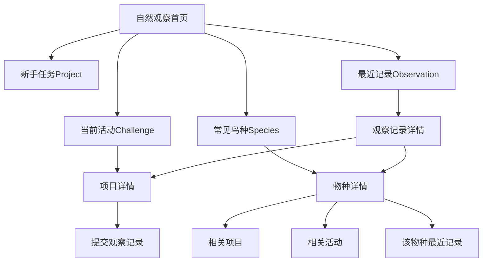
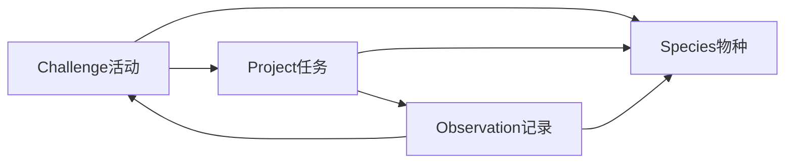

# 鸟类观察产品 PRD 草案

## 一、文档目的

这份文档用于把当前零散的“鸟类观察”相关想法，整理成一套面向用户、可讨论、可分阶段落地的产品方案。

这份 PRD 不再从“现有代码怎么接”出发，而是从产品视角回答以下问题：

- 鸟类观察到底是什么产品
- 用户第一眼应该看到什么
- 主入口应该放在哪里
- `Challenge`、`Project`、`Species`、`Observation` 各自的角色是什么
- 这四种内容如何关联，才不会显得零散
- 第一版应该上线什么，不应该上线什么

## 二、输入材料

本 PRD 主要基于以下内容整理：

- [`docs/BIRD_OBSERVATION_PILOT_PLAN.md`](docs/BIRD_OBSERVATION_PILOT_PLAN.md)
- [`docs/NATURE_OBSERVATION_PRODUCT_PLAN.md`](docs/NATURE_OBSERVATION_PRODUCT_PLAN.md)
- [`docs/html/nature-observation-demo.html`](docs/html/nature-observation-demo.html)
- [`docs/html/nature-observation-challenge-demo.html`](docs/html/nature-observation-challenge-demo.html)
- [`docs/html/nature-observation-unified-demo.html`](docs/html/nature-observation-unified-demo.html)

## 三、产品定义

### 1. 这不是“试点页”，而是一个自然观察频道

用户不应该看到“试点”这个词。

原因很简单：

- “试点”是内部 rollout 语言，不是用户价值表达
- 用户看到“试点”会默认理解为未完成、临时、实验性质
- 它不能回答“这是什么”“我为什么要点进去”“我能在这里做什么”

因此，用户侧应该把当前概念重命名为一个明确的专题或频道，而不是“试点入口”。

### 2. 推荐的用户侧命名

候选命名如下：

1. `自然观察`
2. `鸟类观察`
3. `北京春季观鸟`
4. `春季常见鸟观察`

推荐策略：

- 一级频道名使用：`自然观察`
- 当前专题名使用：`北京春季观鸟`
- 具体活动名使用：`北京春季常见鸟类观察`

这样命名的好处是：

- 一级有长期扩展性，后续可扩展到植物、昆虫等
- 专题有时间和地域感，适合活动运营
- 活动名能直接承接挑战内容

### 3. 核心用户心智

用户进入这个产品，不是来“看一个功能”，而是来完成一条自然观察路径：

- 先知道最近观察什么
- 再知道怎么观察
- 再认识正在观察的物种
- 最后提交自己的真实观察记录

一句话定义：

**自然观察频道是一个把“活动参与、方法学习、物种检索、观察沉淀”整合在一起的专题式产品。**

### 4. 与普通社区 / 普通项目页的区别

普通社区更偏讨论与活动参与，普通项目页更偏做一个任务。

自然观察则不同，它同时需要承载四种价值：

- 用户被活动吸引进入
- 用户通过任务学会怎么观察
- 用户通过物种页完成检索与认知
- 用户通过观察记录沉淀事实数据

所以它不应该只是社区里的一个挑战，也不应该只是探索页里的几个项目。

## 四、核心产品结论

### 1. 四层仍然成立，但不是平铺关系

自然观察应该由四层构成：

1. `Challenge`
2. `Project`
3. `Species`
4. `Observation`

但这四层不是并列展示给用户的四个入口，而是有主次的内容系统。

### 2. 四层角色重新定义

- `Challenge`：活动与动机层，回答“最近值得做什么”
- `Project`：方法与任务层，回答“我该怎么做”
- `Species`：知识与检索中枢，回答“这是什么、我还能怎么继续”
- `Observation`：事实数据层，回答“谁在什么时候哪里看到了什么”

### 3. Species 必须成为中枢

从长期产品结构看，`Species` 应该成为自然观察频道的内容中枢。

原因：

- 用户找的是“某种鸟”，不是某段项目正文
- 物种页天然适合聚合最近记录、相关项目、相关活动
- 物种页是最适合承载长期内容沉淀的位置
- 如果没有物种中枢，所有观察内容会继续散落在项目、挑战和记录列表里

### 4. Challenge 和 Project 是驱动层，Observation 是数据层

这意味着：

- 用户可以从活动进入
- 可以从任务进入
- 但长期内容沉淀最终应该回流到 `Species`
- 真实世界的数据增长最终应该沉到 `Observation`

## 五、信息架构

### 1. 一级结构建议

建议把“鸟类观察”放入一个独立的 `自然观察频道`，而不是继续分散在社区和探索的多个局部入口中。

频道内的一级结构建议如下：

- 自然观察首页
- 当前专题 / 当前活动
- 任务项目
- 物种索引
- 最近观察

### 2. 整体结构图

### 3. 主入口与次入口

#### 主入口

主入口应该放在 `自然观察首页`。

原因：

- 用户进入鸟类观察的第一动机不是“参与社区”
- 而是“我想开始观察”或“我想看最近有什么可观察”
- 所以主入口应该是专题式入口，而不是社区 tab 或项目列表筛选

#### 次入口

次入口可以保留在以下位置：

- 社区中的挑战分发
- 探索页中的鸟类项目
- 物种页或观察记录页中的反向跳转

但这些都应是次入口，而不是主阵地。

## 六、自然观察首页设计

### 1. 首页目标

首页不是对象目录，而是用户的任务入口页。

它需要让用户在最短时间内理解三件事：

1. 这里是什么
2. 我现在可以做什么
3. 我下一步应该点哪里

### 2. 首页建议模块顺序

推荐顺序如下：

1. 当前专题 Banner
2. 新手怎么开始
3. 当前活动 Challenge
4. 推荐任务 Project
5. 常见鸟种 Species
6. 最近观察 Observation

### 3. 各模块说明

#### 模块 1：当前专题 Banner

用于回答“这是什么”。

建议内容：

- 标题：`北京春季观鸟`
- 一句话介绍
- 主 CTA：`开始观察`
- 次 CTA：`查看常见鸟种`

#### 模块 2：新手怎么开始

用于回答“我现在具体怎么开始”。

建议做成三步卡片：

1. 学会观察方法
2. 选择一个地点
3. 提交一条记录

#### 模块 3：当前活动 Challenge

用于回答“最近最值得参与的活动是什么”。

建议首页只展示一个主 Challenge，而不是并排放很多活动。

#### 模块 4：推荐任务 Project

用于回答“我今天可以做什么任务”。

建议展示 2 到 3 个项目，直接面向新手：

- 公园常见水鸟观察
- 校园晨间鸟类观察
- 定点行为观察

#### 模块 5：常见鸟种 Species

用于建立物种认知和检索入口。

建议展示首批 6 到 10 个最容易观察的鸟种。

#### 模块 6：最近观察 Observation

用于展示产品正在积累真实内容，而不是只有静态说明。

每张卡片至少要能看到：

- 时间
- 地点
- 物种
- 行为
- 图片或证据

## 七、页面职责定义

### 1. 首页

首页的唯一主任务：

**把用户带入自然观察路径。**

首页不应该承担：

- 详细物种百科
- 复杂活动规则
- 长篇观察指导正文
- 大量历史记录检索

### 2. Challenge 页

Challenge 页的唯一主任务：

**组织活动，并驱动用户进入具体任务。**

它不应该变成：

- 物种百科页
- 观察记录数据库页
- 纯社区讨论页

建议模块：

- 活动主题
- 时间范围
- 适合谁参加
- 推荐观察场景
- 推荐项目
- 推荐物种
- 最近参与记录
- 主 CTA：`开始第一个任务`

### 3. Project 页

Project 页的唯一主任务：

**教用户怎么完成一次观察。**

它不应该承担：

- 活动总入口
- 全量物种索引
- 大量历史记录分析

建议模块：

- 项目介绍
- 准备什么
- 具体步骤
- 推荐地点
- 你可能会看到哪些鸟
- 提交观察记录

### 4. Species 页

Species 页的唯一主任务：

**帮助用户认识一种鸟，并找到相关行动入口。**

它不只是百科页，更是自然观察的知识与检索中枢。

建议模块：

- 中文名、学名、别名
- 识别特征
- 常见环境
- 北京常见时段
- 最近观察记录
- 相关项目
- 相关挑战
- 主 CTA：`我也去观察`

### 5. Observation 页

Observation 页的唯一主任务：

**展示一次真实观察发生了什么。**

建议模块：

- 时间
- 地点
- 环境
- 观察到的物种
- 数量与行为
- 证据图片
- 关联项目
- 关联挑战
- 返回对应物种页

## 八、关联关系设计

### 1. 关联的基本原则

自然观察体验的核心不是单页，而是内容之间的互相跳转。

必须同时存在两类关联：

- 人工配置关联
- 用户数据生成关联

### 2. 人工配置关联

以下关系必须在第一版就人工配置，不能等用户数据自然长出来：

- `Challenge -> many Projects`
- `Project <-> many Species`
- `Challenge <-> many Species`

原因：

- 第一版内容量小
- 如果没有人工关系，很多页面会是空的
- 用户会感受不到这是一个体系

### 3. 数据生成关联

以下关系可以由用户记录自然累积：

- `Observation -> one or many Species`
- `Observation -> optional Project`
- `Observation -> optional Challenge`
- `Species -> recent Observations`
- `Project -> accumulated Observations`
- `Challenge -> participating Observations`

### 4. 推荐关系图

### 5. 为什么 Project 和 Species 不能只靠 Observation 反推

如果只靠 Observation 反推，前期一定会出现三个问题：

- 项目页不知道“你可能看到哪些鸟”
- 物种页没有“从哪里开始观察我”
- 挑战页无法清楚说明“鼓励观察什么”

因此，第一版必须人工建立：

- 项目推荐物种
- 挑战目标物种或推荐物种组

## 九、内容组织建议

### 1. Challenge 作为“主题活动容器”

推荐一个主 Challenge：

- `北京春季常见鸟类观察`

只保留一个主活动有两个好处：

- 用户不会在多个活动间分散
- 频道首页的信息组织更清楚

### 2. Project 作为“新手任务集”

第一版推荐保留 2 到 3 个项目：

1. `北京公园常见水鸟观察`
2. `校园与社区常见鸟类晨间观察`
3. `定点行为观察：水鸟在做什么`

这三个项目分别对应：

- 场景化入门
- 身边观察
- 行为深化

### 3. Species 作为“首批可认知物种”

第一版建议只做 10 个左右首批物种，不追求大而全。

推荐优先物种：

- 小䴙䴘
- 普通鸬鹚
- 苍鹭
- 大白鹭
- 白鹭
- 池鹭
- 夜鹭
- 黄斑苇鳽
- 绿头鸭
- 大麻鳽

原则：

- 优先公园和湿地里容易观察到的物种
- 优先适合初学者识别和记录的物种
- 优先能与项目场景形成强关联的物种

## 十、用户路径

### 路径 1：从首页进入

`自然观察首页 -> 当前活动 -> 推荐任务 -> 提交观察记录`

适合第一次接触自然观察的用户。

### 路径 2：从活动进入

`Challenge -> Project -> Observation`

适合被活动驱动进入的用户。

### 路径 3：从任务进入

`Project -> Observation -> Species`

适合先学方法，再回头认识物种的用户。

### 路径 4：从物种进入

`Species -> 最近观察 -> 相关项目 / 相关挑战`

适合先找某种鸟的用户。

### 路径 5：从观察记录进入

`Observation -> Species -> Project / Challenge`

适合浏览真实内容后，再回到方法与活动的用户。

## 十一、MVP 范围

### 1. 第一版必须上线的内容

第一版最小范围建议如下：

- 1 个自然观察首页
- 1 个主 Challenge
- 2 到 3 个 Project
- 10 个左右首批 Species
- Observation 提交
- Observation 浏览
- Species 页与 Observation 页最小闭环

### 2. 第一版不做的内容

以下内容不建议进入第一版：

- 大地图系统
- 热力图
- 趋势统计
- 季节分布分析
- 大而全物种库
- 多个 Challenge 并行运营
- 复杂社区机制再包装

### 3. 第一版成功标准

第一版上线后，至少应该验证以下问题：

1. 用户能否快速理解“自然观察首页”是干什么的
2. 用户是否能顺利从首页进入一个任务
3. 用户是否愿意提交结构化观察记录
4. 用户是否会通过物种页继续浏览更多内容
5. `Challenge -> Project -> Observation -> Species` 这条链路是否清晰

## 十二、后续扩展方向

### 1. 从鸟类扩展到更大自然观察体系

如果第一版验证成立，后续可以扩展到：

- 植物观察
- 昆虫观察
- 湿地专题
- 校园自然观察

### 2. 后续可增加的能力

在数据量足够后，再考虑：

- 地图与点位浏览
- 物种热度趋势
- 季节分布
- 热门观察地点
- 专题策展页

## 十三、结论

当前最大的问题不是页面数量不够，而是产品结构对用户来说不够明确。

这份 PRD 的核心结论是：

1. 用户侧不要再展示“试点”
2. 鸟类观察应该以 `自然观察频道` 的方式组织
3. `Species` 应该成为长期中枢
4. `Challenge` 和 `Project` 是驱动层，不是最终沉淀层
5. 第一版只做一个清晰的主专题，不做过度扩张

如果团队接受这套 PRD，下一步就可以进入：

- 页面线框图
- 字段清单
- 后台配置规则
- 内容运营模板

