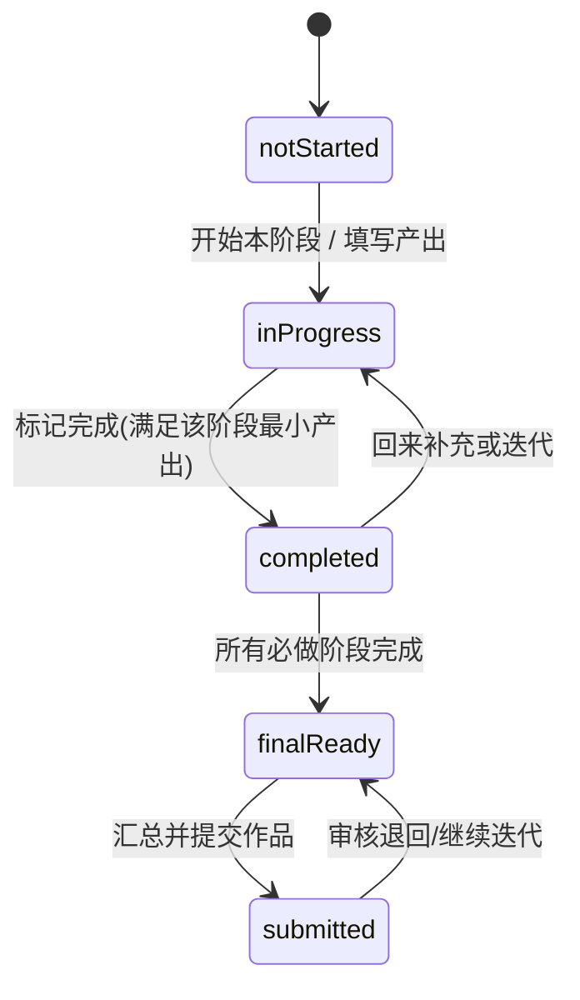
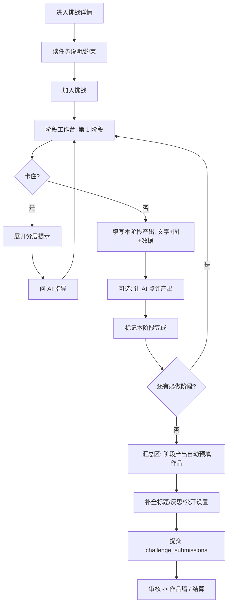

# PBL 阶段引导 + 阶段提交 重构方案

> 本文承接 [PBL_CHALLENGE_SYSTEM.md](/home/arron/work/docs/PBL_CHALLENGE_SYSTEM.md) 与 [PBL_CHALLENGE_CONTENT_MODEL.md](/home/arron/work/docs/PBL_CHALLENGE_CONTENT_MODEL.md)。
>
> 目标：把当前"静态阶段列表 + 末端一次性提交"的 PBL 详情页，重构为"分步引导 + 每阶段产出 + AI 指导"三位一体的学习流程，同时不违背"挑战是任务书、不是菜谱"的内容原则。
>
> 范围说明：本文是**设计/产品方案文档**，不含代码实现。AI 指导按"真接入现有 Qwen 能力"来设计。

---

## 一、现状与问题诊断

当前路由 `/pbl/[id]`（示例：`校园遮阳休息站挑战`）的实现：

- 页面 [app/pbl/[id]/page.tsx](/home/arron/work/app/pbl/[id]/page.tsx) 是一个**纯展示型长页面**：封面 → 任务说明 → 阶段引导 → 相关项目 → 作品墙 → 侧栏提交。
- 阶段引导组件 [components/features/challenge/stage-guide.tsx](/home/arron/work/components/features/challenge/stage-guide.tsx) 把 `stages` 数组里的所有步骤**一次性平铺**，每步仅 `title + description + hint`，纯文字、不可操作、无状态。
- 提交流程 [app/pbl/[id]/submit/page.tsx](/home/arron/work/app/pbl/[id]/submit/page.tsx) → [challenge-submission-form.tsx](/home/arron/work/components/features/challenge/challenge-submission-form.tsx) 是**末端一次性整体表单**（标题 + 图片 + 视频 + 反思 + 参考项目）。
- 数据层（见 [seed 迁移](/home/arron/work/supabase/migrations/20260609183000_seed_school_shade_pbl_project.sql)）：`challenges.stages` 是 `jsonb` 的 `{title,description,hint}[]`；`challenge_submissions` 是**单条整体作品**，没有"阶段进度 / 阶段产出"的概念。
- PBL 流程里**完全没有 AI 指导**。仓库已有 AI 能力（[lib/ai/](/home/arron/work/lib/ai/) 下的 Qwen 视觉、文本自动回复、内容审核），但没有面向学习过程的答疑/反馈。

### 核心问题

| 问题 | 现状 | 后果 |
| --- | --- | --- |
| 阶段一次性铺开 | 4 步同时呈现，无进度、无操作 | 学生没有"我在第几步、这步要交什么"的引导感，过程性消失 |
| 提交与阶段脱节 | 末端交一个大作品，表单字段与约束无对应 | 约束要求的"承重测试""遮阳测试""迭代说明"在提交里无处落地 |
| 引导与产出分离 | 引导在详情页、提交在另一个页面 | 学生看完引导要跳走，回来时上下文丢失 |
| 无 AI 指导 | 卡住时无支撑 | 只能靠静态 hint，分层提示形同虚设 |

---

## 二、设计原则（与内容模型对齐）

复用 [PBL_CHALLENGE_CONTENT_MODEL.md](/home/arron/work/docs/PBL_CHALLENGE_CONTENT_MODEL.md) 已确立的原则，避免重构跑偏：

1. **任务书，不是菜谱**：阶段引导分步，但每步给的是"目标 + 要交什么 + 分层提示"，不是标准答案。
2. **阶段是工作台，不是唯一路径**：分步推进默认是"建议节奏"。采用**软解锁**（建议顺序但允许跳步/回改），不强制线性锁死，保留探究空间（呼应内容模型第五节"脚手架是支撑，不是路线图"）。
3. **过程性证据沉淀**：每个阶段产出汇聚成最终作品，把"承重测试 / 迭代说明"等约束变成可落地的提交字段。
4. **分层提示 + AI 按需指导**：静态分层提示（轻/中/强）默认折叠；AI 指导作为更高一层的按需支撑，**苏格拉底式提问优先，不直接给现成方案**。
5. **不破坏现有结算**：最终仍产出一条 `challenge_submissions`，STEAM 雷达、限时/长期结算逻辑不变。

---

## 三、新模型：阶段工作台（Stage Workspace）

把"阶段引导"与"阶段提交"合并为一个**逐阶段工作台**。每个阶段是一张卡片，包含四块：

1. **引导区**：阶段目标、说明、分层提示（轻 → 中 → 强，逐层展开）。
2. **我的产出区**：本阶段要交的证据。字段由阶段类型决定（见下），支持文字 + 图片（复用现有上传）+ 可选数据/视频。
3. **AI 指导区**：本阶段的"问 AI"入口。两种用法：① 答疑（学生提问，AI 基于挑战与阶段上下文回答）；② 给反馈（AI 点评学生本阶段的产出，含图片）。
4. **状态与推进**：未开始 / 进行中 / 已完成；完成本阶段后引导进入下一阶段（软解锁）。

### 阶段状态机



### 阶段类型（建议给 stage 增加 `kind`，驱动产出字段）

| kind | 含义 | 建议产出字段 | 对应示例挑战阶段 |
| --- | --- | --- | --- |
| `observe` | 观察/调研 | 文字记录 + 现场照片 | 观察真实需求 |
| `design` | 方案/草图 | 文字说明 + 草图照片（≥2 方案） | 提出结构方案 |
| `build_test` | 制作/测试 | 文字 + 照片 + 测试数据（承重/遮阳） | 制作并测试原型 |
| `iterate` | 迭代/反思 | 文字（改了什么、为什么） + 前后对比图 | 迭代并说明取舍 |

> `kind` 为可选；缺省时退化为通用产出（文字 + 图片），保证旧挑战兼容。

---

## 四、信息架构（详情页重构）

保持 [内容模型文档第六节](/home/arron/work/docs/PBL_CHALLENGE_CONTENT_MODEL.md) 的模块顺序，仅把"静态阶段引导 + 独立提交页"替换为"阶段推进工作台"，并新增 AI 指导：

```
1. Hero 区（标题/摘要/难度/类型/主 CTA）            —— 保留
2. 任务说明（情境/驱动问题/目标产出）               —— 保留 pbl-info
3. 约束与完成标准                                   —— 保留
4. 推荐脚手架（参考项目/资料）                       —— 保留
5. 阶段推进工作台  ★新★（替换原 stage-guide）
   └ 每阶段：引导 + 我的产出 + AI 指导 + 状态
6. 提交/汇总区  ★改★（由阶段产出汇总预填，而非独立空表单）
7. 作品墙 / 示例成果                                —— 保留
8. 行动区（加入挑战 / 提交作品）                     —— 保留
```

### 端到端用户流程



---

## 五、数据模型设计

目标：持久化"每个阶段的产出"，同时不破坏现有 `challenge_submissions` 整体作品与结算。

### 方案对比

- **方案 A：独立阶段产出表（推荐）** `challenge_stage_progress`
  - 优点：结构清晰、可单独查询/统计、RLS 简单、便于后续做"阶段完成度"分析与 AI 反馈留存。
  - 缺点：多一张表与一组 API。
- **方案 B：塞进 `challenge_submissions` 的 jsonb**（如 `stage_artifacts jsonb`）
  - 优点：改动小、无新表。
  - 缺点：难以做行级查询/索引、并发更新单条记录易冲突、不利于 AI 交互留存。

建议采用 **方案 A**。

### 建议表结构：`challenge_stage_progress`

| 字段 | 类型 | 说明 |
| --- | --- | --- |
| `id` | bigint PK | |
| `challenge_id` | bigint FK → challenges | 关联挑战 |
| `user_id` | uuid FK → profiles | 学生 |
| `stage_index` | smallint | 对应 `challenges.stages[]` 下标 |
| `status` | text | `not_started` / `in_progress` / `completed` |
| `notes` | text | 本阶段文字产出 |
| `images` | text[] | 本阶段图片（复用 upload 链路） |
| `data` | jsonb | 结构化数据（如承重/遮阳测试值），按 `kind` 解释 |
| `video_url` | text | 可选视频 |
| `ai_feedback` | jsonb | 最近一次 AI 反馈缓存（可选） |
| `created_at` / `updated_at` | timestamptz | |

约束与索引（遵循 [supabase 最佳实践](/home/arron/work/.cursor/skills/supabase-postgres-best-practices/SKILL.md)）：

- 唯一键：`UNIQUE (challenge_id, user_id, stage_index)`，配合 upsert。
- 外键加索引：`(challenge_id, user_id)`、`(user_id)`。
- RLS：本人可读写自己的进度；公开展示只读已完成且作品公开的部分（按需）。

### 类型与映射

- [lib/mappers/types.ts](/home/arron/work/lib/mappers/types.ts) 的 `ChallengeStage` 增补可选 `kind`；新增 `StageProgress` 类型。
- 现有 `challenge_submissions` 不动；提交时把各阶段 `notes/images` **汇总预填**到作品表单（如把 `iterate` 阶段文字预填进 `reflection`，`build_test` 数据进 `iterations`）。

### 迁移落地（遵循 db-migrations 规则）

- 新增 `supabase/migrations/<时间戳>_challenge_stage_progress.sql`，建表 + RLS + 索引。
- 用 `pnpm db:push` 应用（**不要** `supabase db push`）。
- 给 `stages[]` 增补 `kind` 是数据内容层调整，可在 seed/管理后台录入时补充，旧数据缺省兼容。

---

## 六、AI 指导设计（真接入 Qwen）

### 复用现有基础设施

仓库已通过 DashScope（阿里云）OpenAI 兼容接口调用 Qwen，见 [lib/ai/qwen-vision.ts](/home/arron/work/lib/ai/qwen-vision.ts) 与 [lib/ai/auto-reply.ts](/home/arron/work/lib/ai/auto-reply.ts)：

- 环境变量：`DASHSCOPE_API_KEY`、`DASHSCOPE_BASE_URL`、`DASHSCOPE_VISION_MODEL`（默认 `qwen3.6-plus`，支持图文）、`DASHSCOPE_TEXT_MODEL`（默认 `qwen-plus`）。
- 调用方式：`POST {baseUrl}/chat/completions`，`messages` 支持 `text` + `image_url`，支持 `response_format: json_object`。

AI 指导**复用同一套调用骨架**，新增一个 PBL 专用模块即可。

### 新增模块与接口（设计）

- 新增 `lib/ai/pbl-stage-coach.ts`：封装"阶段答疑"与"阶段产出反馈"两个函数。
- 新增 API 路由 `app/api/challenges/[id]/stages/[index]/coach/route.ts`（`POST`）：
  - 入参：`mode: 'qa' | 'review'`、`question?`（qa）、`artifact?`（review：notes + images）。
  - 鉴权：服务端校验登录用户（参照现有受保护 API），写操作均在服务端做。
  - 出参：`{ reply, hints?, followups? }`。

### 两种模式的提示词设计

通用上下文（注入挑战与阶段信息）：挑战标题、驱动问题、约束、当前阶段 `title/description/kind`、学生已填产出摘要。

- **答疑（qa，文本为主）**
  - 角色：青少年 STEAM 项目的"引导老师"。
  - 规则：**苏格拉底式优先**——先反问/给思考方向，再视情况给中/强提示；**不直接给完整方案或代做**；语气贴近青少年、简短、鼓励；不提"AI/模型/平台"。
  - 与静态分层提示衔接：AI 可引用该阶段的轻/中/强提示作为升级路径。
- **产出反馈（review，图文）**
  - 用 `DASHSCOPE_VISION_MODEL` 读取学生本阶段图片 + 文字。
  - 输出结构化 JSON：`{ strengths: string[], gaps: string[], next_actions: string[] }`，对照该阶段 `kind` 的完成要点（如 `build_test` 检查是否有测试数据、是否只改一个变量）。
  - 同样不替学生做决定，只指出缺口与下一步。

### 安全与成本

- **内容安全**：复用现有审核能力（[lib/ai/upload-content-moderation.ts](/home/arron/work/lib/ai/upload-content-moderation.ts) / [completion-moderation.ts](/home/arron/work/lib/ai/completion-moderation.ts)）对上传图片把关；AI 文本输出做基础过滤。
- **限流与降级**：对 coach 接口做每用户/每阶段频率限制；DashScope 失败时回退到静态分层提示，给出友好兜底文案（参照 `getObservationVisionUserMessage` 模式）。
- **留存**：可选把最近一次反馈写入 `challenge_stage_progress.ai_feedback`，避免重复调用并支持复看。

### AI 指导出现的位置（回答"AI 指导在哪里"）

- 主入口：每个**阶段工作台卡片**内的"问 AI / 让 AI 看看"按钮（按需触发，不自动弹出）。
- 次入口：汇总提交区，"让 AI 通读我的整体作品给一次总评"（可选，二期）。

---

## 七、与现有系统的集成

- **最终提交**：沿用 [challenge-submission-form.tsx](/home/arron/work/components/features/challenge/challenge-submission-form.tsx) 与 `challenge_submissions`；区别是表单从"空白"变为"由阶段产出预填"。
- **结算/STEAM**：限时与长期挑战的结算、STEAM 雷达逻辑完全不变（见 [PBL_CHALLENGE_SYSTEM.md](/home/arron/work/docs/PBL_CHALLENGE_SYSTEM.md) 结算章节）。
- **管理后台**：挑战编辑处增加每个阶段的 `kind` 选择（可选），不影响旧挑战。
- **PROJECT_INDEX.md**：实施阶段需同步更新 `challenge/` 组件数量与新 API、新表条目（遵循项目规则）。

---

## 八、分期落地建议

按风险与价值递进，**每期都可独立上线**：

- **第一期：前端体验（无后端持久化）**
  - 把 `stage-guide` 升级为可分步展开、带状态的工作台 UI（状态存前端/本地）。
  - 把分层提示做成折叠展开。
  - 价值：立刻解决"一次性铺开"的体验问题，零数据库风险。
- **第二期：阶段产出持久化**
  - 新增 `challenge_stage_progress` 表 + API + RLS。
  - 阶段产出落库，提交表单由阶段产出汇总预填。
  - 价值：把过程性证据真正沉淀，约束可落地。
- **第三期：AI 指导真接入**
  - 新增 `lib/ai/pbl-stage-coach.ts` + coach API + 阶段卡片 AI 入口。
  - 答疑（文本）先行，产出反馈（图文）随后。
  - 价值：卡住时的高质量支撑，分层提示升级为可对话指导。

---

## 九、验收标准

判断重构是否达成目标（呼应内容模型第十节）：

1. 学生进入后清楚"现在在第几步、这步要交什么"。
2. 每个阶段能独立填写并保存自己的产出（图/文/数据）。
3. 阶段产出能自动汇总为最终作品，约束要求（测试/迭代）有对应落点。
4. 卡住时可在**当前阶段**就近获得分层提示与 AI 指导，且 AI 以提问/反馈为主、不直接代做。
5. 不同学生仍可能提交明显不同但都合理的方案（未把路径写死）。
6. 限时/长期结算、STEAM 雷达、作品墙行为不受影响。

---

## 十、待确认的开放问题

1. 软解锁 vs 硬解锁：是否允许学生跳过未完成的阶段直接推进？（本文默认软解锁）
2. 阶段产出是否计入公开展示（作品墙是否展示过程而不仅是成品）？
3. AI 指导是否需要按会员/额度区分调用次数？
4. `kind` 是否需要在第一期就引入，还是二期随持久化一起上？
