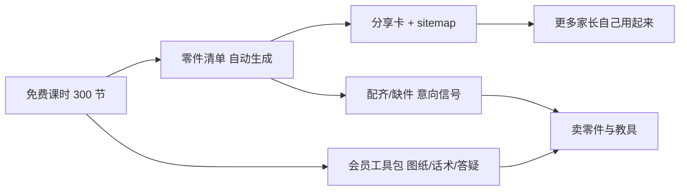

# 免费课主食 + 积木变现：产品方向与实施方案（暂不实施）

> 状态：**方案记录，暂不实施**。2026-08-13 定稿。
>
> 本文只描述方向、约束与实施顺序，不代表代码已存在。开始实施时再同步更新 `PROJECT_INDEX.md`。

---

## 1. 定位（决策已定）

- **免费课是主食**：现有 300 节大颗粒课时 + Scratch + 游乐场保持免费、不登录可用。**不新增任何课程付费墙**。
- **会员是工具不是课**：图纸、家长引导话术、答疑、AI 额度。价格是年费课的零头。本轮**不接支付**，用兑换码 + 后台开通。
- **钱出在积木和教具上**：本轮只做零件清单与需求信号，**不做商城、订单、收款、物流**。
- **目标人群是家长自己带孩子玩**，不是机构老师。教师备课包不是这一轮的重点。

### 产品红线

计划落地为 `docs/monetization-principles.md`，供后续人工与 AI 改动共同遵守：

1. 免费课永久免费，课程流程内不插付费墙。
2. 不做倒计时、限时优惠、名额告急一类逼单组件。
3. 不主动电话、不在孩子的学习界面里向孩子推销、不出现「让妈妈报名」类文案。
4. 会员随时可停，不做自动续费诱导。
5. 直播不做成「上课」，是有人在线一起搭、卡住了问一声。

### 价值链



---

## 2. 现状盘点（2026-08-13 调研结论）

### 2.1 已经有的资产

- **课程与课时完全公开**：`app/courses/page.tsx`、`app/courses/[courseId]/page.tsx`、`app/courses/[courseId]/lessons/[lessonId]/page.tsx` 均无登录门禁，匿名可看完整课时内容（含 `content` JSONB）。`proxy.ts` 不对 `/courses` 做鉴权。RLS 只按 `courses.status = 'approved'` 放行，没有会员/付费字段。
- **44 个自托管 LDraw 模型**：`public/courses/ldraw/*.mpd`，里面带真实零件号与颜色码。`lib/utils/ldraw-mpd.ts` 已能 `splitPackedMpd` 拆主模型 + 内联子文件，并按 `0 STEP` 切分步骤。
- **零件元数据**：`.agents/skills/image-to-ldraw/references/part-metadata.json` 收录 381 个 Duplo 零件的英文名、`category`、`studFootprint`、`heightLdu`。
- **BOM 聚合逻辑已有原型**：`.agents/skills/image-to-ldraw/scripts/ldraw-common.mjs` 里有 `parseLdrawType1Line` 与 `summarizeBom`（按 `partId:colorCode` 聚合），但服务于 assembly JSON 管线，没有「读 MPD → BOM」的现成路径。
- **搭建说明 PDF 已入库**：`content.building3d.slidesPdfUrl` 有值，前端刻意不渲染（`lib/courses/types.ts` 注释已写明）。
- ~~**家长/教师引导已存在且免费**~~：**已于 2026-08-14 删除**。`content.teacherGuide` / `learningGoals` 的渲染层（`LessonGuidePanel`）与类型定义均已移除，因为线上 316 节课两个字段都是 0 条（详见 `docs/product-design-review-2026-08-14.md`）。曾为两门试点课写过 24 节完整引导文案，随 `20260628220000_remove_legacy_brick_courses.sql` 删课失效，文案仍保留在迁移文件的 git 历史中，可作为重建家长引导的素材来源。

### 2.2 缺口

| 缺口 | 证据 |
|------|------|
| 免费内容无法被搜到 | `app/sitemap.ts` 完全没有课程/课时 URL（只有项目、物种、观察） |
| 免费内容无法被转发 | `components/features/works/share-work-dialog.tsx` 的 `ShareCardContent.kind` 只有 `work` / `project` |
| 没有零件清单 | 课时页只有「本步零件」（`building-3d-workspace.tsx` 约 1561-1586），没有整课清单；`content.building3d.parts` 部分课时缺失 |
| 会员没有任何内容权益 | 全仓库唯一 gate 是 AI 代币配额（`lib/api/ai-credits.ts`、`app/api/tutor/chat/route.ts`） |
| 没有兑换码/支付/订单 | 搜索 pay/order/redeem/coupon/wechat/alipay 无业务实现；`/shop` 的「兑换」只是金币换头像框 |
| 没有会员介绍页 | 无 `/pricing`、`/membership` 路由；AI 超额文案提到「开通会员」但没有落点 |
| 会员变更无审计 | `app/api/admin/users/[id]/membership/route.ts` 直接 update profiles，无流水、无 adminId |

### 2.3 必须先处理的两个硬约束

**（a）`membership_*` 字段没有被保护 —— 安全洞**

`supabase/migrations/20260609120000_profile_membership_fields.sql` 只建列 + CHECK，没有 RLS。`protect_profiles_sensitive_fields`（`20260801090000_interaction_access_and_secure_xp.sql` 约 65-81）保护 `role/xp/coins`，**不含** membership 四字段；而 `profiles` 上存在用户自更新策略。结论：用户理论上可以自己把自己改成会员。**在往会员上挂任何权益之前必须先补这个洞**，否则权益等于白送。

**（b）`/api/assets` 没有用户鉴权 —— 图纸不能靠隐藏 UI**

`app/api/assets/[...path]/route.ts` 是路径白名单 + Referer 代理，**没有任何 session 检查**。同时课时 `content`（含 `slidesPdfUrl`）会整份下发给匿名用户，URL 在页面源码里就能看到。CDN 的 Referer 防盗链挡不住经本站代理的请求。结论：会员图纸必须走独立鉴权路由，并把 URL 从公开 payload 里剥离。

**（c）覆盖面提醒**：300 节课时里只有 44 个有真实模型，零件清单初期只能覆盖这 44 课。没有模型的课时**不显示清单**，不要造假数据。

---

## 3. 实施顺序

### 阶段一：零件清单（免费、公开、可分享）

整条链的地基，也是最接近高赞内容形态的东西（「乐高怎么买」的答案）。

1. 新增 `lib/utils/ldraw-bom.ts`，复用 `lib/utils/ldraw-mpd.ts` 的拆分能力，只解析**主模型的 type-1 行**：

```ts
export function summarizeMpdBom(mpdText: string): LessonBomItem[]
export function summarizeMpdBomByStep(mpdText: string): LessonBomItem[][]
```

解析坑（已验证）：
- 只能统计主模型放置件。内联 `parts/`、`p/` 图元（`stud8.dat`、`box5.dat`）是几何 primitive，不是可购买零件。`duplo-car.mpd` 主模型 3 条 vs 全文件 146 条即为例证。
- 子文件里的 `1 16 ...` 表示继承父色，必须回溯父级 colorCode。
- 印刷件（如 `3437pe1.dat`）单独列，或映射到基础件 + 印刷标注。
- BOM 停在顶层放置的 `.dat`，不展开子模型（与现有人工清单策略一致）。

2. 新增 `lib/courses/ldraw-colors.ts` 解析 `public/courses/ldraw/LDConfig.ldr` 的 `0 !COLOUR <名> CODE <码> VALUE <#hex> EDGE <#hex>`，配一张常用色中文名表（十几个色够用；LDConfig 本身没有中文名）。零件中文名放 `lib/courses/duplo-part-names.ts`，先覆盖 44 个模型实际用到的零件号，缺失时回退英文名 + 尺寸。

3. 新增 `scripts/generate-ldraw-bom.mjs`，构建期产出 `public/courses/ldraw/<name>.bom.json`。**不要在请求时解析 MPD**（单文件上限 16MB，`app/api/courses/ldraw-step/route.ts` 已有并发与缓存限制可参考）。

4. 数据类型修正：`Building3DPart.color` 目前被 UI 当 hex 用，但课件 manifest 里存的是「绿色」这类中文，会导致 `backgroundColor` 无效。改为 `colorHex` + `colorLabel`。

5. UI：在 `components/features/courses/building-3d-workspace.tsx` 搭建区新增「这一课要用的零件」整课清单，与现有「本步零件」并列。必须保证移动端可见（`building_3d` 在移动端隐藏了 `LessonSidebar`，见 `lesson-page-client.tsx` 约 323-324）。

### 阶段二：让免费的能被搜到、被转发

6. `app/sitemap.ts` 补 `/courses`、`/courses/[courseId]`、`/courses/[courseId]/lessons/[lessonId]`（已审核课程，按 `updated_at`）。课程页已有 `generateMetadata`，不需要重做。

7. `components/features/works/share-work-dialog.tsx` 的 `ShareCardContent.kind` 扩到 `"course" | "lesson"`，新增 `createCourseShareContent` / `createLessonShareContent`，卡片带成品图、课名、二维码，落 `/courses/...` 规范链接。课程详情页与课时页各加一个分享入口。

8. `/courses` 顶部加一段不需要登录的「在家怎么用」三步说明：挑一课 → 看零件清单 → 跟着 3D 分步搭。明确免费、不用报名、不打断孩子。

### 阶段三：会员做成工具包

9. **先补安全洞**：新增迁移把 `membership_tier/period/started_at/expires_at` 纳入 `protect_profiles_sensitive_fields`，会员写入只允许 service role / SECURITY DEFINER RPC；新增 `membership_events` 审计表；`app/api/admin/users/[id]/membership/route.ts` 从 anon client 直更改为经 RPC 并记录 adminId。迁移按 `.cursor/rules/db-migrations.mdc` 用 `pnpm db:push`，不要用 `supabase db push`。

10. **图纸下载（会员）**：新增 `app/api/courses/[courseId]/lessons/[lessonId]/instructions/route.ts`，服务端读 profile 判 `isMembershipActive` 后再流式转发 PDF；同时在课时数据下发前剥掉 `slidesPdfUrl`。`/api/assets` 保持公开，不在那里加会员判断（它同时服务大量公开资源）。

11. **家长引导话术**：原方案假设 `content.teacherGuide` 作为免费基础层、`content.parentScript` 作为会员增值层。**基础层已删除**（见 2.1），所以这条要重做：家长引导目前是 0，需要先补一层**免费**的基础引导（怎么开场、孩子卡住了怎么问、搭完问哪三句），素材可从 `20260627172000` / `20260627174000` / `20260628125000` 三个迁移里那 24 节已写好的文案迁移改写。只有在免费层立住之后，再谈会员增值层（延伸玩法、跨课主题包）。先在有模型的 44 课铺。

12. **答疑不建直播基建**：会员问题走现有 `app/api/settings/feedback` 到官方账号的私信链路，加会员优先标记。「一起搭」先用公告时段，不做课堂化直播系统、不倒计时、不逼单。

13. **兑换码开通**：新增 `redemption_codes` 表 + 一次性原子 `redeem_membership_code()` RPC（参考 `purchase_item` / `admin_adjust_ai_credit` 的 SECURITY DEFINER + 流水模式），`/settings/membership` 提供兑换入口。新增 `/membership` 介绍页，明确「不是课、价格是年费课零头、随时可停、不会给孩子推销」，个人中心加入口。

### 阶段四：验证积木与教具需求（不收款）

14. 零件清单上加「我要配这套 / 我缺这几件」，写入 `part_demand_signals`（用户、课时、零件号、颜色、数量）。后台出需求看板：哪些零件最多人缺、哪些课最多人想配齐。这是决定要不要备货、要不要开店的唯一依据。

15. 新增 `part_substitutes` 替代件映射，直接对着断货痛点：Spike 停产、9656/9686 缺货时给出可替代零件与本站课时。

---

## 4. 本轮明确不做

支付与订单、站内商城、物流发货、直播课系统、课程付费墙、任何倒计时或限时优惠组件、教师备课包（留到确认老师这拨人是否值得单独做）。

---

## 5. 待定问题

- 零件清单按 `partId` 聚合（忽略分色，如「黄色/绿色」）还是按 `partId:colorCode` 分行？现有人工清单是前者（8 行），自动统计是后者（同一课 13 行）。影响采购体验，需要看到真实清单后再定。
- 会员价格与周期具体数字未定，只定了「年费课的零头」。
- 缺件计算是否需要用户维护自己的零件库存？先看阶段四的需求信号，再决定要不要做这个较重的功能。
- 没有 3D 模型的 256 节课时，清单从哪里来（课件 BOM 页人工补 / 半自动识别 / 暂不提供）。
